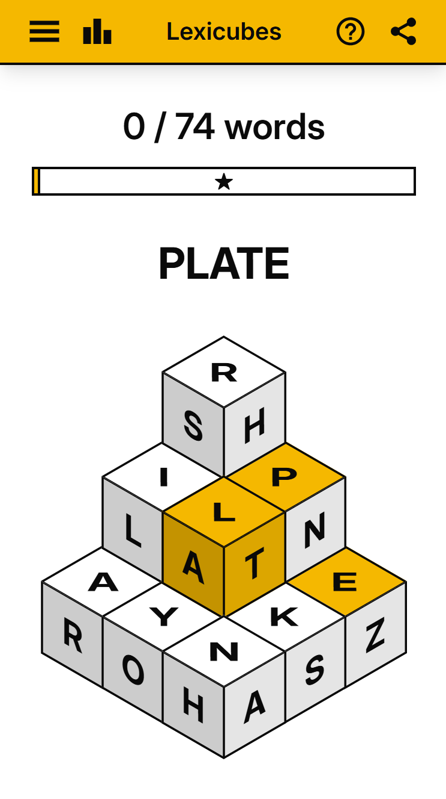

# [Lexicubes](https://lexicubes-game.web.app/)

Lexicubes is a Boggle-like word search game played on a set of isometric cubes. The frontend is written in TypeScript with React and
Tailwind CSS. The backend is written in Java with Spring Boot and MySQL for the database.



## Running the site locally

### Getting started

#### Backend

1. Ensure that you have [Gradle](https://gradle.org/) and [Docker](https://www.docker.com/) installed.

2. Open the project in Intellij IDEA and run the
   `BackendApplication` configuration. Alternatively, you can run the app via the command line using the Gradle wrapper:

   ```bash
   cd backend
   ./gradlew bootRun
   ```

   The backend should be running and visible at
   `http://localhost:8080`. The app should automatically spin up a Docker container with a MySQL database (for development purposes) and connect to the database without any extra
   configuration.

#### Frontend

1. Ensure that you have [npm](https://docs.npmjs.com/downloading-and-installing-node-js-and-npm) installed.

2. Install all dependencies:
   ```bash
   cd frontend
   npm install
   ```

3. Start the [Vite](https://vite.dev/guide/) development server:

   ```bash
   npm run dev
   ```

   The site should be visible at `http://localhost:5173`.
